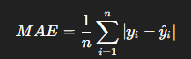
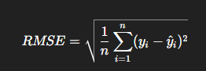

# Laporan Proyek Machine Learning - Ghani Husna Darmawan

## Domain Proyek

Proyek ini berfokus pada permasalahan di sektor retail, khususnya dalam memprediksi penjualan mingguan di Walmart, salah satu jaringan ritel terbesar di Amerika Serikat. Prediksi penjualan sangat penting untuk membantu perusahaan dalam pengelolaan stok, pengadaan barang, dan strategi pemasaran yang lebih efektif. 

Menurut laporan dari McKinsey & Company, perusahaan yang mampu menerapkan prediksi permintaan dengan baik dapat meningkatkan margin keuntungan hingga 2-3% dan mengurangi kelebihan stok hingga 20% \[1]. Oleh karena itu, pengembangan model prediksi penjualan merupakan bagian penting dalam implementasi Machine Learning di dunia bisnis nyata.

---

## Business Understanding

### Problem Statements

- Bagaimana tren penjualan mingguan di Walmart selama periode waktu tertentu?
- Bagaimana korelasi antara fitur numerik seperti suhu, harga bahan bakar, CPI, dan pengangguran terhadap penjualan mingguan?
- Apakah model Machine Learning dapat memprediksi penjualan mingguan secara akurat?

### Goals

- Menganalisis pola tren dan musiman pada data penjualan Walmart.
- Mengidentifikasi faktor-faktor yang memengaruhi volume penjualan mingguan.
- Membangun model time series untuk memprediksi penjualan mingguan di masa depan.

### Solution Statements

- Menggunakan dua algoritma time series forecasting: Prophet dan SARIMAX.
- Memilih model terbaik berdasarkan metrik evaluasi RMSE dan MAE.

---

## Data Understanding

Dataset yang digunakan adalah **Walmart Store Sales Forecasting** yang tersedia di Kaggle:  
[https://www.kaggle.com/datasets/yasserh/walmart-dataset](https://www.kaggle.com/datasets/yasserh/walmart-dataset)

### Variabel yang Digunakan:

| Variabel      | Deskripsi                              |
|---------------|--------------------------------------|
| `Store`       | ID unik masing-masing toko            |
| `Date`        | Tanggal transaksi penjualan           |
| `Weekly_Sales`| Total penjualan mingguan              |
| `Holiday_Flag`| Indikator hari libur                  |
| `Temperature` | Suhu rata-rata mingguan               |
| `Fuel_Price`  | Harga bahan bakar                     |
| `CPI`         | Consumer Price Index                  |
| `Unemployment`| Tingkat pengangguran                  |

### Eksplorasi Awal

- Dataset terdiri dari 6.435 baris dan 8 kolom.
- Tidak terdapat missing value.
- Ditemukan beberapa outlier pada kolom `Weekly_Sales` yang dihilangkan menggunakan metode IQR.

### Visualisasi

- Plot tren total penjualan mingguan memperlihatkan pola musiman.

- Weekly_Sales vs. Weekly_Sales: Nilainya 1, seperti yang diharapkan, karena ini adalah korelasi variabel dengan dirinya sendiri.
- Weekly_Sales vs. Temperature: Korelasinya -0.044. Ini adalah korelasi negatif yang sangat lemah, mendekati nol. Artinya, tidak ada hubungan linier yang signifikan antara penjualan mingguan dan suhu.
- Weekly_Sales vs. CPI: Korelasinya -0.07. Juga korelasi negatif yang sangat lemah.
- Temperature vs. CPI: Korelasinya 0.18. Ini menunjukkan korelasi positif yang lemah. Artinya, sedikit peningkatan suhu mungkin sedikit berkorelasi dengan peningkatan CPI, tetapi hubungannya tidak terlalu kuat.
- CPI vs. Unemployment: Korelasinya -0.3. Ini adalah korelasi negatif moderat. Artinya, ketika CPI meningkat, tingkat pengangguran cenderung sedikit menurun, atau sebaliknya. Ini menunjukkan adanya hubungan linier, meskipun tidak sempurna.
- Fuel_Price vs. Unemployment: Korelasinya -0.035. Sangat lemah dan mendekati nol.

- Kesimpulan:
Secara keseluruhan, heatmap ini memungkinkan kita untuk dengan cepat melihat seberapa kuat dan dalam arah apa (positif atau negatif) setiap pasang variabel saling berhubungan secara linier. Ini adalah alat yang sangat berguna dalam analisis data untuk memahami hubungan antar fitur/variabel dalam dataset.

---

## Data Preparation

- Konversi kolom `Date` menjadi format datetime.
- Agregasi total `Weekly_Sales` berdasarkan `Date` untuk membentuk time series tunggal.
- Rename kolom menjadi `ds` dan `y` agar sesuai format input Prophet.
- Urutkan data berdasarkan tanggal.
- Split data untuk evaluasi: 12 minggu terakhir sebagai data test.

---

## Modeling

### Model 1: Prophet

- Model additive dari Facebook Prophet cocok untuk tren dan musiman.
- Tidak dilakukan hyperparameter tuning.
- Forecasting dilakukan untuk 12 minggu ke depan.

### Model 2: SARIMAX

- Model statistik berbasis ARIMA dengan faktor musiman.
- Parameter yang digunakan: order=(1,1,1), seasonal_order=(1,1,1,52).
- Forecast dilakukan pada periode test.

---

## Evaluation

### Metrik Evaluasi

1. **Mean Absolute Error (MAE)**  
MAE mengukur rata-rata nilai absolut selisih antara prediksi dengan nilai aktual.
  
Dimana 𝑦 𝑖 y i ​ adalah nilai aktual dan 𝑦 ^ 𝑖 y ^ ​ i ​ adalah nilai prediksi.

2. **Root Mean Squared Error (RMSE)**
RMSE memberikan penalti lebih besar terhadap error yang besar dengan menghitung akar dari rata-rata kuadrat error.
   
RMSE sering digunakan dalam forecasting karena lebih sensitif terhadap deviasi besar.

### Hasil Evaluasi

### Kesimpulan

Model **SARIMAX** memberikan performa lebih baik dibandingkan Prophet berdasarkan metrik MAE dan RMSE, sehingga dipilih sebagai model terbaik untuk prediksi penjualan mingguan Walmart.

---

## Referensi

\[1] McKinsey & Company. (2019). *How retailers can drive profitable growth through demand forecasting*.

---

*Catatan: Visualisasi tren, boxplot outlier, dan heatmap korelasi tersedia dalam notebook proyek.*

