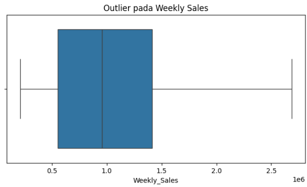
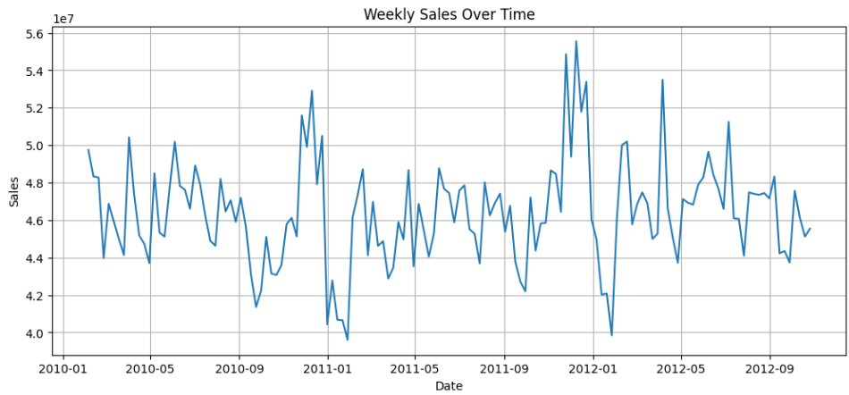
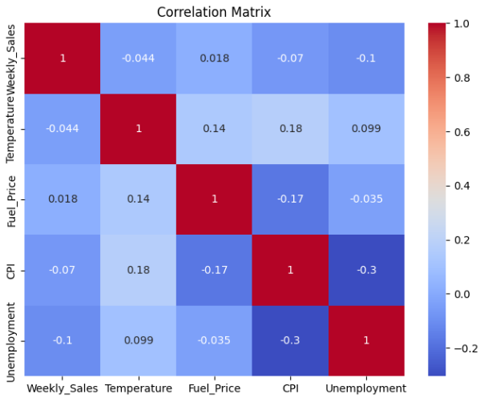
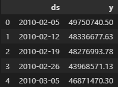
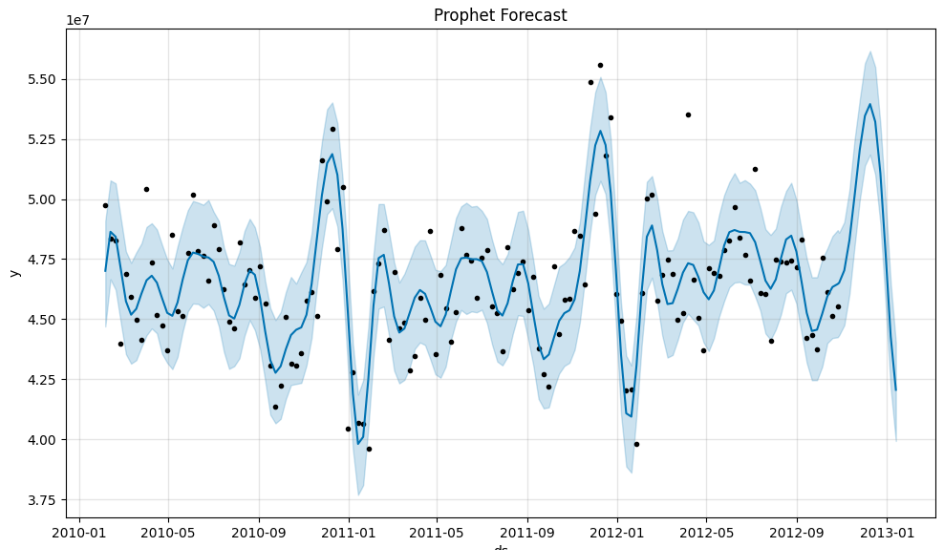
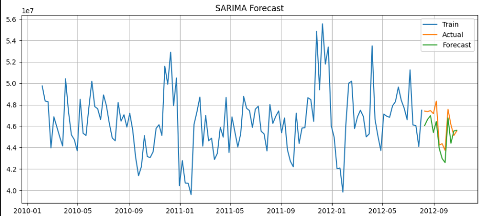
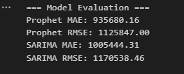

# Laporan Proyek Machine Learning - Ghani Husna Darmawan

## Domain Proyek

Proyek ini mengangkat permasalahan pada sektor retail, khususnya dalam memprediksi penjualan mingguan dari Walmart, salah satu ritel terbesar di Amerika Serikat. Prediksi penjualan sangat penting untuk membantu perusahaan dalam pengambilan keputusan terkait manajemen stok, pengadaan barang, hingga strategi pemasaran.

Menurut laporan McKinsey, perusahaan yang mampu menerapkan prediksi permintaan dengan baik dapat meningkatkan margin keuntungan hingga 2-3% dan mengurangi kelebihan stok hingga 20% \[1]. Oleh karena itu, pemodelan prediksi penjualan menjadi salah satu bagian penting dalam implementasi Machine Learning di dunia nyata.

## Business Understanding

### Problem Statements

* Bagaimana tren penjualan mingguan di Walmart selama periode waktu tertentu?
* Bagaimana korelasi antara fitur-fitur numerik seperti suhu, harga bahan bakar, CPI, dan pengangguran terhadap penjualan mingguan?
* Dapatkah model Machine Learning memprediksi penjualan mingguan secara akurat?

### Goals

* Menganalisis pola tren dan musiman dari data penjualan Walmart.
* Mengidentifikasi faktor-faktor yang memengaruhi volume penjualan mingguan.
* Membangun model time series untuk memprediksi penjualan mingguan di masa depan.

### Solution Statements

* Menggunakan dua algoritma time series forecasting yaitu Prophet dan SARIMAX.
* Memilih model terbaik berdasarkan metrik evaluasi RMSE dan MAE.

## Data Understanding

Dataset yang digunakan adalah **Walmart Store Sales Forecasting** yang tersedia di Kaggle: [https://www.kaggle.com/datasets/yasserh/walmart-dataset](https://www.kaggle.com/datasets/yasserh/walmart-dataset)

### Variabel yang Digunakan:

* `Store`: ID toko
* `Date`: Tanggal transaksi
* `Weekly_Sales`: Total penjualan mingguan
* `Holiday_Flag`: Indikator hari libur
* `Temperature`: Suhu rata-rata mingguan
* `Fuel_Price`: Harga bahan bakar
* `CPI`: Consumer Price Index
* `Unemployment`: Tingkat pengangguran

### Eksplorasi Awal:

* Dataset terdiri dari 6435 baris dan 8 kolom.
* Tidak terdapat missing value.
* Ditemukan beberapa outlier pada kolom `Weekly_Sales` yang kemudian dihilangkan menggunakan metode IQR.

### Visualisasi:

* Plot tren total penjualan mingguan memperlihatkan pola musiman.

* Heatmap korelasi menunjukkan hubungan lemah antara variabel numerik dan penjualan.

## Data Preparation

* Konversi kolom `Date` menjadi format datetime.
* Agregasi total `Weekly_Sales` berdasarkan `Date` untuk membentuk time series tunggal.
* Rename kolom menjadi `ds` dan `y` agar sesuai dengan format input Prophet.

* Urutkan data berdasarkan tanggal.
* Split data untuk evaluasi: 12 minggu terakhir sebagai data test.

## Modeling

### Model 1: Prophet

* Model additive dari Facebook Prophet cocok untuk tren dan musiman.
* Tidak dilakukan hyperparameter tuning.
* Forecasting dilakukan untuk 12 minggu ke depan.

### Model 2: SARIMAX

* Model statistikal berbasis ARIMA dengan faktor musiman.
* Parameter yang digunakan: order=(1,1,1), seasonal\_order=(1,1,1,52)
* Forecast dilakukan pada periode test.

## Evaluation

### Metrik Evaluasi

* **MAE (Mean Absolute Error)**: Rata-rata error absolut antara prediksi dan aktual.
* **RMSE (Root Mean Squared Error)**: Akar dari error kuadrat rata-rata, memberi penalti lebih besar pada error besar.

### Hasil Evaluasi:

### Kesimpulan:

Model **SARIMAX** memberikan performa yang lebih baik dibandingkan Prophet berdasarkan kedua metrik evaluasi, sehingga dipilih sebagai model terbaik untuk digunakan dalam prediksi penjualan mingguan Walmart.

---

**Referensi:**

\[1] McKinsey & Company. (2019). How retailers can drive profitable growth through demand forecasting.

*Catatan: Visualisasi tren, boxplot outlier, dan heatmap korelasi tersedia dalam notebook proyek.*
