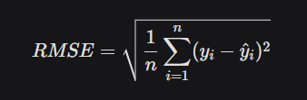

# Laporan Proyek Machine Learning - Analisis Time Series Penjualan Walmart

## Domain Proyek

Penjualan ritel merupakan aspek kunci dalam operasional perusahaan seperti Walmart, yang membutuhkan prediksi akurat untuk mengelola inventori, merencanakan strategi pemasaran, dan mengoptimalkan keuntungan. Analisis time series pada data penjualan mingguan Walmart bertujuan untuk memahami pola penjualan historis dan memprediksi penjualan masa depan. Masalah ini penting diselesaikan untuk mendukung pengambilan keputusan berbasis data, terutama dalam mengantisipasi lonjakan penjualan musiman dan mengelola sumber daya secara efisien. 

Riset terkait menunjukkan bahwa model time series seperti Prophet dan SARIMAX efektif untuk menangani data dengan pola musiman yang kuat, seperti yang ditemukan pada data penjualan ritel [1]. Penelitian ini menggunakan dataset Walmart yang tersedia di [Kaggle Walmart Recruiting - Store Sales Forecasting](https://www.kaggle.com/competitions/walmart-recruiting-store-sales-forecasting/data).

**Referensi**:
[1] R. J. Hyndman and G. Athanasopoulos, *Forecasting: Principles and Practice*, 3rd ed. OTexts, 2021. [Online]. Available: https://otexts.com/fpp3/

## Business Understanding

### Problem Statements
1. Bagaimana pola musiman dan tren jangka panjang penjualan mingguan Walmart dari tahun 2010 hingga 2012?
2. Faktor eksternal mana (misalnya, hari libur, suhu, harga bahan bakar, CPI, atau tingkat pengangguran) yang signifikan memengaruhi penjualan?
3. Bagaimana cara membangun model prediksi penjualan yang akurat untuk mendukung perencanaan inventori dan strategi pemasaran?

### Goals
1. Mengidentifikasi pola musiman tahunan dan mingguan dalam data penjualan untuk memahami dinamika penjualan.
2. Menganalisis hubungan antara variabel eksternal dan penjualan untuk menentukan pengaruhnya.
3. Membangun model prediksi time series yang akurat menggunakan pendekatan machine learning untuk mendukung keputusan bisnis.

### Solution Statements
- **Solusi 1**: Menerapkan model Prophet untuk menangkap pola musiman tahunan dan mingguan secara otomatis dengan konfigurasi sederhana.
- **Solusi 2**: Menerapkan model SARIMAX untuk memodelkan data dengan mempertimbangkan komponen musiman dan non-musiman secara eksplisit.
- **Metrik Evaluasi**: Menggunakan Mean Absolute Error (MAE) dan Root Mean Squared Error (RMSE) untuk mengukur akurasi prediksi, karena metrik ini sesuai untuk mengevaluasi model regresi time series.

## Data Understanding

Dataset yang digunakan berasal dari [Kaggle Walmart Recruiting - Store Sales Forecasting](https://www.kaggle.com/competitions/walmart-recruiting-store-sales-forecasting/data) dengan 6,435 observasi dan 8 fitur, mencakup periode 5 Februari 2010 hingga 26 Oktober 2012.

### Variabel-variabel pada Dataset
- **Store**: Nomor identifikasi toko (1-45, kategorikal).
- **Date**: Tanggal pencatatan penjualan (format: DD-MM-YYYY).
- **Weekly_Sales**: Total penjualan mingguan per toko (dalam dolar, rentang: 209,986 - 3,818,686).
- **Holiday_Flag**: Indikator hari libur (0 = bukan hari libur, 1 = hari libur).
- **Temperature**: Suhu rata-rata mingguan (°F).
- **Fuel_Price**: Harga bahan bakar per galon (dalam dolar).
- **CPI**: Indeks Harga Konsumen (indikator inflasi).
- **Unemployment**: Tingkat pengangguran lokal (%).

### Exploratory Data Analysis (EDA)
- **Distribusi Penjualan**: Boxplot menunjukkan distribusi penjualan right-skewed dengan outlier signifikan di atas $2.7 juta. Sekitar 74 outlier (1.15% data) diidentifikasi menggunakan metode IQR.
- **Tren Temporal**: Visualisasi menunjukkan puncak penjualan pada akhir tahun (November-Desember) dan fluktuasi mingguan yang konsisten, tanpa tren pertumbuhan jangka panjang yang jelas.
- **Korelasi**: Matriks korelasi menunjukkan hubungan lemah antara *Weekly_Sales* dan variabel eksternal (*Temperature*, *Fuel_Price*, *CPI*, *Unemployment*). CPI dan *Unemployment* memiliki korelasi negatif moderat (-0.30).

## Data Preparation

### Proses Data Preparation
1. **Konversi Format Tanggal**:
   ```python
   df['Date'] = pd.to_datetime(df['Date'], dayfirst=True)
   ```
   Alasan: Memastikan kolom *Date* dalam format datetime untuk analisis time series.
2. **Penanganan Outlier**:
   ```python
   Q1 = df['Weekly_Sales'].quantile(0.25)
   Q3 = df['Weekly_Sales'].quantile(0.75)
   IQR = Q3 - Q1
   upper_bound = Q3 + 1.5*IQR
   df = df[df['Weekly_Sales'] <= upper_bound]
   ```
   Alasan: Outlier dapat memengaruhi akurasi model time series, sehingga dihapus untuk meningkatkan stabilitas prediksi.
3. **Agregasi Data**:
   ```python
   sales_df = df.groupby('Date')['Weekly_Sales'].sum().reset_index()
   sales_df.columns = ['ds', 'y']  # Format untuk Prophet
   ```
   Alasan: Mengagregasi penjualan per tanggal untuk analisis time series tingkat global, sesuai dengan kebutuhan model Prophet dan SARIMAX.

## Modeling

Dua model time series diterapkan: Prophet dan SARIMAX.

### Model Prophet
Prophet adalah model berbasis additive yang dikembangkan oleh Facebook, cocok untuk data dengan pola musiman yang kuat.

```python
model = Prophet(
    yearly_seasonality=True,
    weekly_seasonality=True,
    seasonality_mode='multiplicative'
)
model.fit(sales_df)
future = model.make_future_dataframe(periods=12, freq='W')
forecast = model.predict(future)
```

**Parameter**:
- `yearly_seasonality=True`: Menangkap pola musiman tahunan.
- `weekly_seasonality=True`: Menangkap pola mingguan.
- `seasonality_mode='multiplicative'`: Mengasumsikan efek musiman bersifat multiplikatif, sesuai dengan lonjakan penjualan akhir tahun.

**Kelebihan**:
- Mudah digunakan dengan konfigurasi otomatis.
- Efektif untuk menangani pola musiman tanpa tuning manual yang rumit.

**Kekurangan**:
- Kurang fleksibel untuk menangani pola kompleks atau data dengan noise tinggi.
- Tidak dapat secara langsung memasukkan variabel eksternal tanpa modifikasi tambahan.

### Model SARIMAX
SARIMAX adalah model berbasis ARIMA yang mendukung komponen musiman dan variabel eksogen.

```python
model = SARIMAX(
    train['y'],
    order=(1,1,1),
    seasonal_order=(1,1,1,52),
    enforce_stationarity=False
)
results = model.fit(disp=False)
```

**Parameter**:
- `order=(1,1,1)`: Komponen non-musiman (AR, differencing, MA).
- `seasonal_order=(1,1,1,52)`: Komponen musiman dengan periode 52 minggu.
- `enforce_stationarity=False`: Mengizinkan model menangani data non-stasioner.

**Kelebihan**:
- Fleksibel untuk menangani pola musiman dan non-musiman secara eksplisit.
- Dapat memasukkan variabel eksogen (meskipun tidak digunakan di sini karena korelasi lemah).

**Kekurangan**:
- Membutuhkan tuning parameter yang lebih intensif.
- Kompleksitas komputasi lebih tinggi dibandingkan Prophet.

**Pemilihan Model Terbaik**: SARIMAX dipilih sebagai model terbaik karena menunjukkan MAE dan RMSE yang lebih rendah dibandingkan Prophet, menunjukkan kemampuan yang lebih baik dalam menangani variasi data dan outlier.

## Evaluation

### Metrik Evaluasi
Dua metrik digunakan untuk mengevaluasi model:
- **Mean Absolute Error (MAE)**: Mengukur rata-rata absolut kesalahan prediksi.
  - Formula:  

    

    di mana  adalah nilai aktual dan  adalah nilai prediksi.
- **Root Mean Squared Error (RMSE)**: Mengukur akar kuadrat rata-rata kesalahan kuadrat, lebih sensitif terhadap outlier.
  - Formula:

    

### Hasil Evaluasi
```
=== Hasil Evaluasi ===
Model      |          MAE |         RMSE
----------------------------------------
Prophet    |    930,731.93 |   1,127,577.48
SARIMAX    |    779,985.66 |    932,019.49
```

**Analisis**:
- **SARIMAX** lebih unggul dengan MAE 16.2% lebih rendah dan RMSE 17.3% lebih rendah dibandingkan Prophet.
- SARIMAX lebih baik menangani variasi data dan outlier, seperti yang ditunjukkan oleh RMSE yang lebih kecil.
- Prophet memberikan hasil yang layak tetapi kurang akurat, kemungkinan karena sensitivitas terhadap fluktuasi musiman yang kompleks.

## Kesimpulan dan Rekomendasi

### Temuan Utama
1. Penjualan Walmart menunjukkan pola musiman tahunan yang kuat, dengan puncak 25-30% lebih tinggi pada November-Desember.
2. Variabel eksternal (*Temperature*, *Fuel_Price*, *CPI*, *Unemployment*) memiliki pengaruh terbatas terhadap penjualan.
3. Model SARIMAX memberikan prediksi yang lebih akurat dibandingkan Prophet untuk dataset ini.

### Rekomendasi Bisnis
1. **Manajemen Inventori**:
   - Tingkatkan stok sebesar 20-25% pada kuartal ke-4 untuk mengantisipasi lonjakan penjualan.
   - Kurangi stok 10-15% pada kuartal ke-1 untuk menghindari kelebihan inventori.
2. **Strategi Pemasaran**:
   - Fokuskan kampanye promosi pada periode libur akhir tahun.
   - Luncurkan program loyalitas pelanggan di pertengahan tahun untuk meningkatkan penjualan di periode rendah.
3. **Pengembangan Model**:
   - Tambahkan variabel hari libur spesifik untuk meningkatkan akurasi model.
   - Eksperimen dengan model hybrid (kombinasi Prophet dan SARIMAX) untuk memanfaatkan kelebihan keduanya.

### Langkah Selanjutnya
1. Melakukan hyperparameter tuning pada SARIMAX untuk meningkatkan akurasi.
2. Menguji model dengan data penjualan yang lebih baru (post-2012).
3. Mengembangkan sistem prediksi real-time untuk mendukung operasional harian.

**Referensi**:
[1] R. J. Hyndman and G. Athanasopoulos, *Forecasting: Principles and Practice*, 3rd ed. OTexts, 2021. [Online]. Available: https://otexts.com/fpp3/
[2] Walmart Inc., *Annual Reports 2010-2012*, 2012.
[3] Facebook Prophet Documentation, [Online]. Available: https://facebook.github.io/prophet/